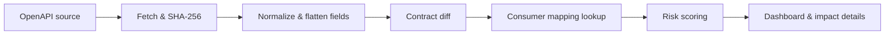

# API Contract Guardian

API Contract Guardian is a modular-monolith MVP for finding downstream API risk when an upstream OpenAPI contract changes. It preserves contract history, compares normalized response schemas, applies casing-aware rename heuristics, resolves manually maintained consumer mappings, and calculates a deterministic risk score.



## Run the demo

Prerequisites: Docker Desktop. Then run:

```bash
docker compose up --build
```

Open http://localhost:5173. The seeded `Customer API` begins with the local v1 fixture and three consumer mappings. Select **Run demo: compare v2** to switch to the local v2 fixture and create a history entry, a likely `user_name → userName` rename, an `integer → number` change, and impacts for the three mappings. No internet access is needed by the demo.

For backend-only development, run `mvn spring-boot:run` in `backend`; it uses H2 by default. Set `SPRING_DATASOURCE_URL`, `SPRING_DATASOURCE_USERNAME`, and `SPRING_DATASOURCE_PASSWORD` for PostgreSQL.

## Project layout

- `backend/src/main/java/.../contract` — retrieval, canonicalization, and OpenAPI 2/3-compatible response flattening.
- `comparison` — diff rules and rename detector.
- `mapping`, `impact`, `notification`, `scheduler` — imports, matching, scoring, notifications, and polling.
- `backend/src/main/resources/db/migration` — Flyway schema.
- `frontend/src` — Vite/React/TypeScript Material UI dashboard.
- `samples/customer-mappings.csv` — import-ready mapping file (the demo API uses id `1`).

## REST API

The application's own OpenAPI 3 contract is at [`backend/src/main/resources/static/openapi.yaml`](backend/src/main/resources/static/openapi.yaml). When the backend is running, it is also served at `http://localhost:8080/openapi.yaml`.

| Method | Endpoint | Purpose |
|---|---|---|
| POST /api/apis | Register and fetch an API |
| GET /api/apis | List monitored APIs |
| POST /api/apis/{id}/check | Check source URL now |
| GET /api/apis/{id}/contracts | Contract history |
| GET /api/apis/{id}/changes | Current contract changes |
| GET /api/apis/{id}/impacts | Impacts for current changes |
| POST /api/mappings/import/csv | Import mappings (`file` multipart field) |
| POST /api/mappings/import/xlsx | Import mappings (`file` multipart field) |
| GET /api/mappings | List mappings |
| DELETE /api/mappings/{id} | Delete mapping |
| GET /api/dashboard/summary | Dashboard figures |
| GET /actuator/health | Health check |

Example registration:

```bash
curl -X POST http://localhost:8080/api/apis -H "Content-Type: application/json" -d '{"name":"Orders","application":"data-api","team":"data-team","environment":"QA","swaggerUrl":"https://example.com/openapi.json","pollingEnabled":true}'
```

## How matching and risk work

Contracts are parsed as JSON or YAML. The comparison uses a sorted canonical document to avoid irrelevant-order noise and flattens response schemas to JSON paths. Removed and added fields in the same response with equivalent canonical identifiers (for example `user_name`, `userName`, `UserName`) are classified as a likely rename at 98% confidence; other similarities require at least 90% confidence.

Impacts match producer API, HTTP method, path, and affected field. A rename matches its old path. Base scores are BREAKING 80, POTENTIALLY_BREAKING 50, and NON_BREAKING 10; mandatory mapping adds 10, production adds 5, more than three impacted consumers adds 5, and a high-confidence rename subtracts 10. Scores map to CRITICAL 90–100, HIGH 70–89, MEDIUM 40–69, and LOW 0–39.

## Scope and limitations

The MVP prioritizes JSON response bodies. It resolves local component references, nested objects, arrays, requiredness, nullable, enum, primitive and structural type changes. Request bodies, parameters, external `$ref`s, composition (`oneOf`/`allOf`), constraint comparisons, authentication, real email delivery, and a full semantic OpenAPI validator are intentionally deferred. The email service is a clean stub; the logging notifier is active.

## Validation

Run `mvn test` from `backend` and `npm run build` from `frontend`. Docker Compose contains PostgreSQL, backend, and frontend services. The application also runs a configurable 15-minute polling job (`POLLING_INTERVAL_MS`).

## Roadmap

Add authenticated ownership, richer request/parameter schema comparisons, configurable policy storage, change acknowledgements, real notification transports, external reference resolution, and broader integration/UI tests.
